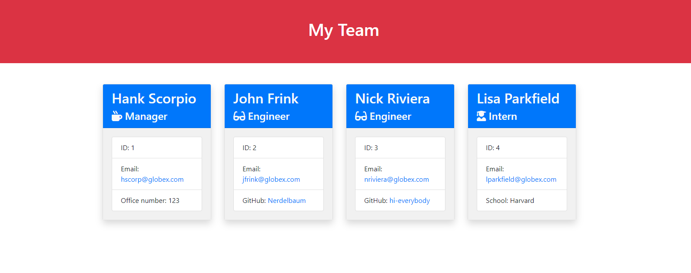
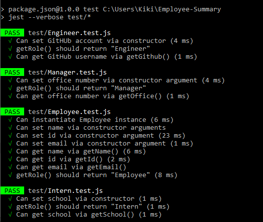

<h1 align="center">Employee-Summary</h1>
  
 

## Description
This is a CLI that will prompt for Manager and employee information before generating an HTML webpage to display each employee. 

## Table of Contents
- [Description](#description)
- [Installation](#installation)
- [Usage](#usage)
- [License](#license)
- [Contributors](#contributors)
- [Tests](#tests)
- [Questions](#questions)

## Installation
This requires jest and inquirer.

## Usage
This project is a tool to track each employee and their git hub and/or emails for manager's use.

## License

 
This application is covered by the ISC license. 

## Contributors
N/A

## Tests
npm run test

## Questions
https://github.com/Arkpeggs/Employee-Summary 
 
Find me on GitHub: [Arkpeggs](https://github.com/Arkpeggs) 
 
Email me with any questions: arkthelass@gmail.com  
    
